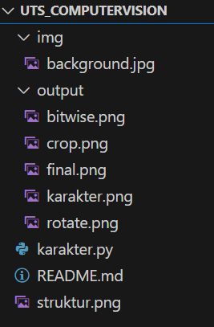
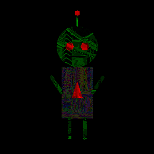

Nama    : Mufid Annas
NIM     : 43050230012
Kelas   : 5A-Teknologi Informasi

## 🤖Karakter
Karakter yang dibuat adalah robot yang terinspirasi dari karakter **Kamen Rider** dengan desain sederhana:
- Kepala hijau berbentuk lingkaran
- Mata merah berbentuk lingkaran  
- Badan abu-abu berbentuk persegi psnjang 
- Sensor segitiga merah di dada 
- Lengan dan kaki hijau 
- Antena di kepala dengan ujung lingkaran merah 

## 🔄Transformasi dan Operasi
### 🧭Transformasi:
    Translasi : Menggeser posisi robot ke kanan bawah.
    Rotasi    : Memutar karakter sebesar 30 derajat.
    Crop      : Memotong bagian tengah gambar robot untuk fokus pada kepala dan badan.
### ⚙️Operasi Bitwise:
    Bitwise AND : Mengambil irisan antara karakter dan background.
    Bitwise OR  : Menggabungkan karakter dengan background untuk efek transparan.

## 📸Screenshot

## 🖼️ Hasil Akhir
### Karakter Asli  

### Rotasi  

### Crop  

### Bitwise  

### Final  

